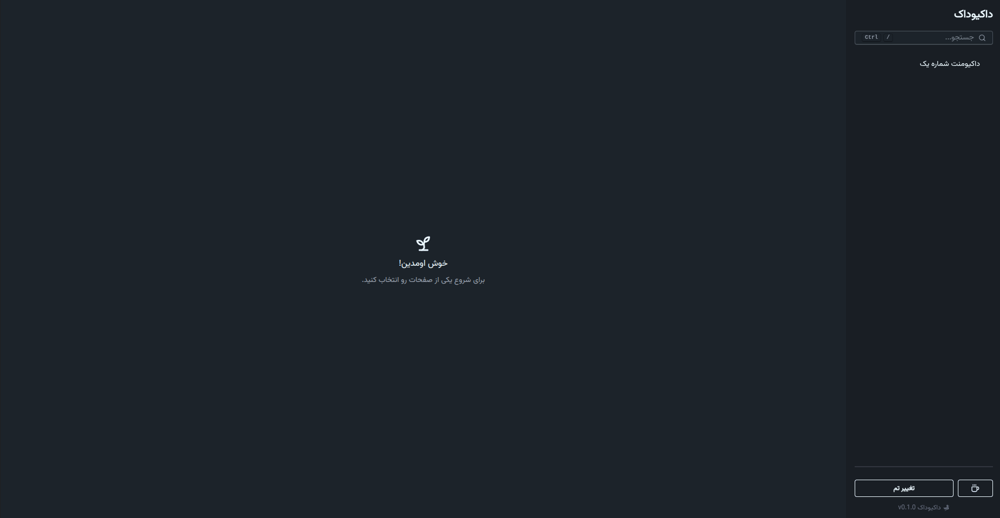
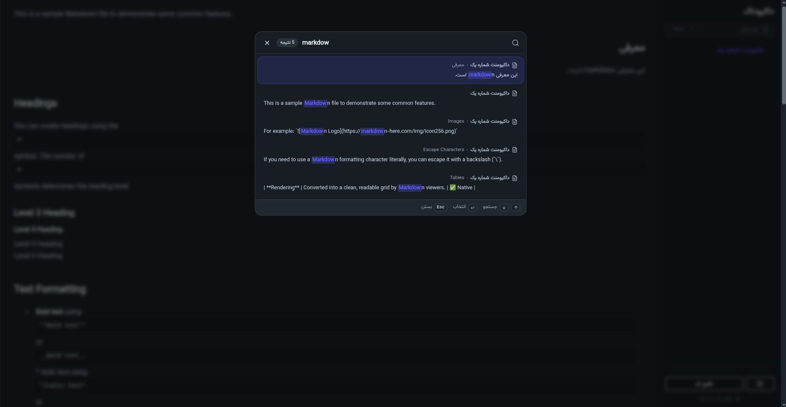

# Docuduck (WIP)

<p align="center">
  
</p>

Docuduck turns Markdown files into a simple documentation site.

It is built with Vite, React, TanStack Router, and Tailwind/DaisyUI. Pages are loaded from Markdown files in `src/markdown`, rendered with GitHub-flavored Markdown, syntax highlighting, and a full-text search modal.

## Screenshots





## Features

- Markdown-driven docs pages with automatic page discovery.
- Front matter support for page metadata such as `label` and `order`.
- Full-text search across page titles, headings, slugs, and content.
- Keyboard-friendly search modal with `Ctrl + /` or `Cmd + /`.
- Light/dark theme toggle with persisted preference.
- Persian/RTL-aware rendering for content that contains Arabic script.
- Syntax highlighting for fenced code blocks.
- GitHub Pages-friendly base path handling.

## Tech Stack

- React 19
- Vite 8
- TanStack Router
- Tailwind CSS 4
- DaisyUI
- `react-markdown`
- `remark-gfm`
- `rehype-highlight`
- `front-matter`
- `fuse.js`

## Project Structure

- `src/routes/` - TanStack Router route components.
- `src/markdown/` - Markdown source files that become documentation pages.
- `src/markdownLoader.jsx` - Markdown discovery, indexing, search, and snippet helpers.
- `src/NavMenu.jsx` - Sidebar navigation and theme controls.
- `src/SearchBox.jsx` / `src/SearchModal.jsx` - Search entry point and modal UI.
- `src/contexts.jsx` - App configuration context.
- `config.json` - Site title, welcome message, description, and optional coffee link.

## Getting Started

### Prerequisites

- Node.js 20 or newer is recommended.
- A package manager such as npm, pnpm, or yarn.

### Install dependencies

```bash
npm install
```

### Run the development server

```bash
npm run dev
```

Vite will print the local URL in the terminal. Open it in the browser to preview the site.

### Build for production

```bash
npm run build
```

### Preview the production build locally

```bash
npm run preview
```

### Lint the project

```bash
npm run lint
```

## Adding Documentation Pages

Create a new `.md` file in `src/markdown`. Each file becomes a page automatically.

Example:

```md
---
order: 2
label: Getting Started
---

# Getting Started

Welcome to the docs.

## Installation

Your content here.
```

### Front Matter

The loader reads Markdown front matter and supports these fields:

- `label` - the name shown in the sidebar and search results.
- `order` - numeric sort order for navigation.

If no `label` is provided, the file name is used.
If no `order` is provided, the page falls back to `0`.

### Headings and Search

Docuduck uses the first `#` heading as the page title and `##` headings as searchable sections.

- Search results are grouped by file and heading.
- Search snippets come from the matching section when possible.
- Page anchors are generated from heading text.

### Markdown Rendering Notes

- GitHub-flavored Markdown tables, task lists, and fenced code blocks are supported.
- Code blocks are highlighted with `rehype-highlight`.
- Content containing Arabic script is rendered with RTL-aware alignment for better readability.

## Configuration

Site metadata lives in `config.json`.

```json
{
	"title": "داکیوداک",
	"welcome": "خوش اومدین!",
	"description": "برای شروع یکی از صفحات رو انتخاب کنید.",
	"coffee": {
		"show": true,
		"link": "#"
	}
}
```

### Fields

- `title` - browser title and main site title.
- `welcome` - homepage welcome text.
- `description` - homepage helper text.
- `coffee.show` - shows or hides the support button in the sidebar.
- `coffee.link` - target URL for the support button.

## Navigation and Search

- The sidebar lists Markdown pages in `order`.
- Use the search bar or press `Ctrl + /` on Windows/Linux or `Cmd + /` on macOS.
- Search supports keyboard navigation with arrow keys and `Enter`.
- Selecting a result opens the matching page and jumps to the relevant section.

## Theme

The sidebar includes a theme toggle. The selected theme is stored in `localStorage` and restored on the next visit.

## Deployment Notes

Docuduck is ready for static hosting and subpath deployments.

- Vite base handling is derived from the repository environment so GitHub Pages-style subpaths work correctly.
- TanStack Router uses `import.meta.env.BASE_URL` as the router base path.
- When deploying as a single-page app, make sure your host serves `index.html` for unmatched routes.
